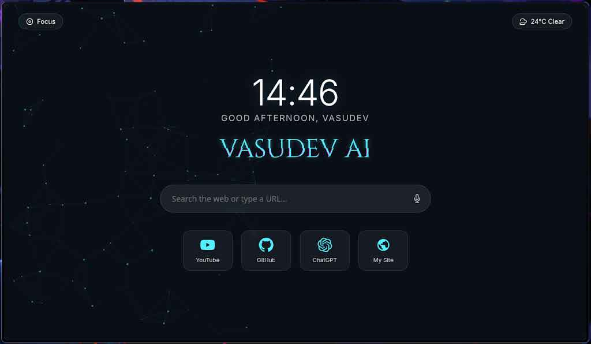

# 🌌 Vasudev Browser (Powered by Vasudev AI)


**Vasudev Browser** is a next-generation, premium web browser built with Electron. It combines futuristic aesthetics with intelligent functionality, featuring a dynamic UI that adapts to the web you browse.

---

## 📸 Screenshots

<div align="center">
  
  <p><i>The Ultimate Homepage with Particles & Glassmorphism</i></p>
</div>

<div align="center">
  
  <p><i>Dynamic Theming & Smart Omnibox</i></p>
</div>

---

## ✨ Key Features

### 🎨 **Immersive UI & Design**
*   **Glassmorphism Aesthetic**: Premium frosted glass effects across the interface.
*   **Dynamic Theming**: The entire browser window (background, controls, address bar) adapts its color scheme to match the dominant color of the website you are visiting.
*   **Smart Dark Mode**: Automatically adjusts text and icon contrast based on the page's brightness for optimal readability.
*   **Frameless Design**: A clean, edge-to-edge experience with custom-styled window controls.

### 🚀 **Next-Gen Functionality**
*   **Smart Omnibox**:
    *   **Clean URLs**: Hides `https://` and `www.` for a cleaner look (shows full URL on focus).
    *   **Title First**: Displays the page title by default.
    *   **Direct Search**: Type any query to search Google instantly.
    *   **Rich Suggestions**: Dropdown with search predictions and history.
*   **Ultimate Homepage**:
    *   **Interactive Particles**: A constellation background that reacts to your mouse.
    *   **Voice Search**: Integrated voice command functionality.
    *   **Focus Mode**: One-click distraction-free mode.
    *   **Speed Dial**: Quick access to your favorite sites (YouTube, GitHub, ChatGPT).
    *   **Live Dashboard**: Real-time clock, weather widget, and dynamic greetings.
    *   **Audio Feedback**: Sci-fi inspired sound effects for interactions.

### 🛡️ **Security & Navigation**
*   **Security Badge**: Visual indicator for secure (HTTPS) connections.
*   **Smooth Navigation**: Custom Back, Forward, Reload, and Home controls.
*   **Loading Progress**: Subtle, animated progress bar integrated into the address bar.

---

## 🛠️ Installation

Ensure you have [Node.js](https://nodejs.org/) installed on your system.

1.  **Clone the Repository**
    ```bash
    git clone https://github.com/yourusername/vasudev-browser.git
    cd vasudev-browser
    ```

2.  **Install Dependencies**
    ```bash
    npm install
    ```

3.  **Run the Browser**
    ```bash
    npm start
    ```

---

## 🖥️ Usage

*   **Navigation**: Use the top-left controls to navigate history or return Home.
*   **Search**: Click the address bar or press `/` (on homepage) to start typing.
*   **Focus Mode**: On the homepage, click the "Focus" button in the top-left to hide distractions.
*   **Voice Search**: Click the microphone icon on the homepage search bar to speak your query.

---

## 🤝 Contributing

We welcome contributions from the community to make Vasudev Browser even better!

1.  **Fork the Project**
2.  **Create your Feature Branch** (`git checkout -b feature/AmazingFeature`)
3.  **Commit your Changes** (`git commit -m 'Add some AmazingFeature'`)
4.  **Push to the Branch** (`git push origin feature/AmazingFeature`)
5.  **Open a Pull Request**

---

## 📜 License

Distributed under the MIT License. See `LICENSE` for more information.

---

<div align="center">
  <p>Built with ❤️ by <b>Vasudev AI</b></p>
  <p><i>"Redefining the Web Experience"</i></p>
</div>
